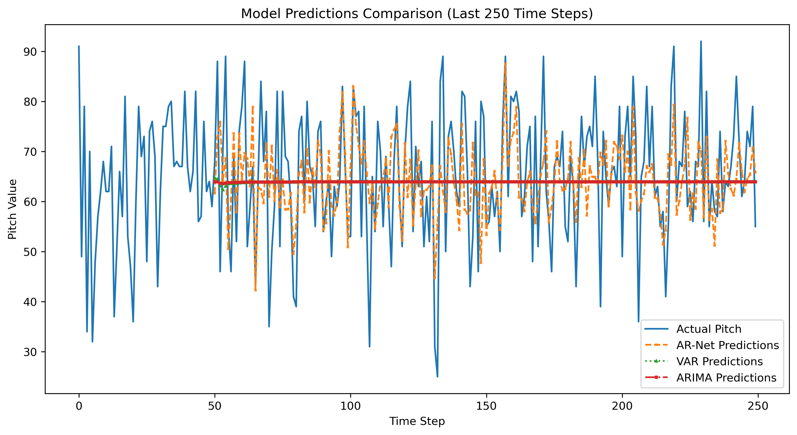
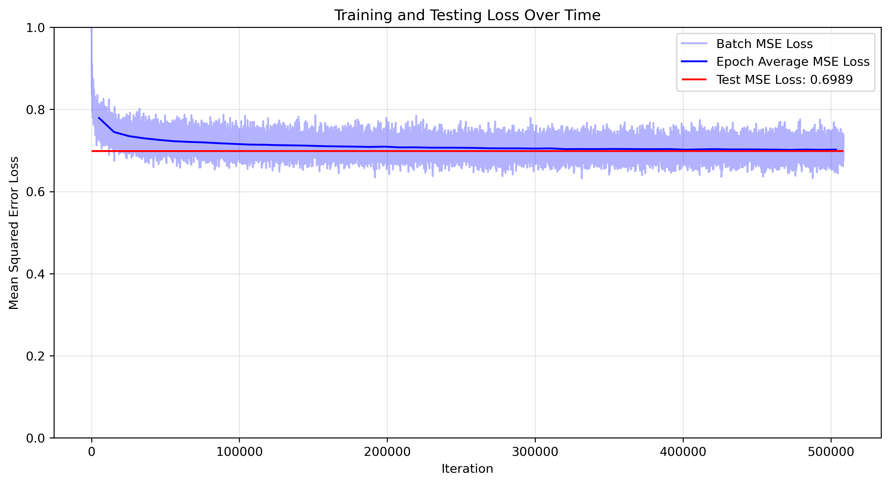
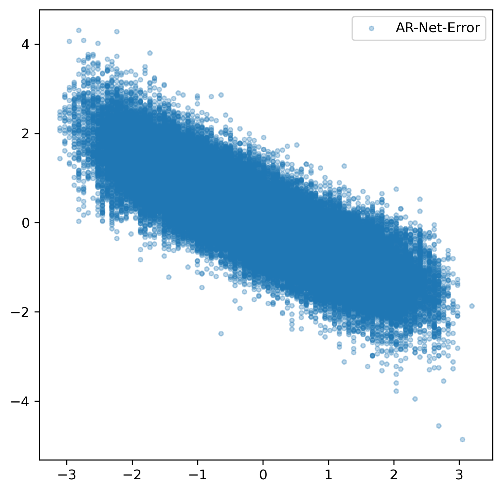

# MIDI Sequence Prediction with Multiple Models

This project implements and compares different approaches for MIDI sequence prediction using three different models: Deep Autoregressive Network (DAR), Vector Autoregression (VAR), and ARIMA. The project uses the MAESTRO dataset for training and evaluation.

## Features

- Deep Autoregressive Network (DAR) for MIDI sequence prediction
- Vector Autoregression (VAR) model for multivariate time series
- ARIMA model for univariate time series
- Comprehensive evaluation metrics (MSE, Entropy, NLL)
- Visualization tools for model comparison
- Support for MAESTRO dataset processing
- Data normalization and preprocessing
- PCA-based dimensionality reduction

## Requirements

- Python 3.7+
- PyTorch
- NumPy
- Pandas
- Matplotlib
- Seaborn
- Statsmodels
- PrettyMIDI
- scikit-learn
- pmdarima

## Installation


1. Install the required packages:
```bash
pip install -r requirements.txt
```

2. Download the MAESTRO dataset:
- Visit the [MAESTRO dataset website](https://magenta.tensorflow.org/datasets/maestro)
- Download the dataset
- Extract it to the project directory

## Project Structure

```
midi-sequence-prediction/
├── Autoregressive_model.py    # Main implementation file
├── requirements.txt           # Project dependencies
├── README.md                  # This file
├── plots/                     # Directory for saved plots and metrics
```

## Usage

1. Basic usage:
```python
from Autoregressive_model import main

# Run with default settings
main(verbose=True, plot=True, save=True)
```

2. Configuration:
The model parameters can be adjusted in the `load_config()` function:
- Data settings (sequence length, test split ratio)
- Model settings (number of layers, hidden dimensions, dropout rate)
- Training settings (learning rate, epochs, batch size)

## Model Architecture

### Deep Autoregressive Network (DAR)
- Multi-layer neural network with dropout
- Input: Sequence of MIDI features (pitch, velocity, duration)
- Output: Predicted pitch value
- Features:
  - Batch normalization
  - Dropout regularization
  - Configurable architecture

### Vector Autoregression (VAR)
- Multivariate time series model
- Handles all MIDI features simultaneously
- Automatic lag order selection
- Covariance matrix analysis

### ARIMA
- Univariate time series model
- Applied to PCA-reduced data
- Automatic parameter selection
- Seasonal component support

## Example Outputs and Analysis

### Model Predictions Comparison


This plot shows the comparison between predictions from all three models (DAR, VAR, and ARIMA) against the actual MIDI sequence. The predictions are shown for the last 250 time steps, with:
- Blue line: Actual pitch values
- Red dashed line: DAR model predictions
- Green dotted line: VAR model predictions
- Purple dash-dot line: ARIMA model predictions

Key observations from the prediction plot:
1. The actual MIDI sequence (blue line) shows high variability and non-linear patterns, which is characteristic of musical data
2. The DAR model (red dashed line) demonstrates better adaptability to these non-linear patterns, showing more dynamic predictions that follow the actual data's complexity
3. Both VAR (green dotted line) and ARIMA (purple dash-dot line) models show more stable, linear-like predictions that converge after a few time steps
4. The VAR and ARIMA models struggle to capture the sudden changes and complex patterns in the MIDI sequence, as they are designed for linear relationships

### Training Progress


The training progress visualization shows:
- Blue line: Batch-wise training loss
- Red line: Average epoch loss
- Green line: Test set loss

This helps in monitoring the model's learning progress and identifying potential overfitting.

### Model Metrics Comparison


The metrics comparison shows the performance of all three models across different evaluation metrics:
- MSE (Mean Squared Error)
- Entropy
- NLL (Negative Log Likelihood)

Interesting insights from the metrics:
1. **Entropy Analysis**:
   - The DAR model shows higher entropy in its predictions compared to VAR and ARIMA
   - This higher entropy indicates that the DAR model maintains more diversity in its predictions, better reflecting the natural variability in MIDI data
   - The lower entropy of VAR and ARIMA suggests they produce more uniform, less diverse predictions

2. **NLL (Negative Log Likelihood) Analysis**:
   - Despite having higher entropy, the DAR model achieves a lower NLL
   - This apparent contradiction is actually meaningful:
     - The DAR model's higher entropy allows it to capture the complex, non-linear patterns in the MIDI data
     - The lower NLL indicates that these diverse predictions are more accurate in terms of likelihood
     - This suggests the DAR model better models the true distribution of the MIDI sequence

3. **Model Capabilities**:
   - The DAR model's architecture (with multiple layers and non-linear activations) enables it to learn complex, non-linear relationships in the MIDI data
   - VAR and ARIMA models, being linear models, can only capture linear relationships and struggle with the non-linear patterns in MIDI sequences
   - This explains why VAR and ARIMA predictions appear more stable but less accurate in capturing the true dynamics of the MIDI sequence

### Error Analysis


The error scatter plot shows the distribution of prediction errors across different pitch values, helping to identify any systematic biases in the model's predictions.

